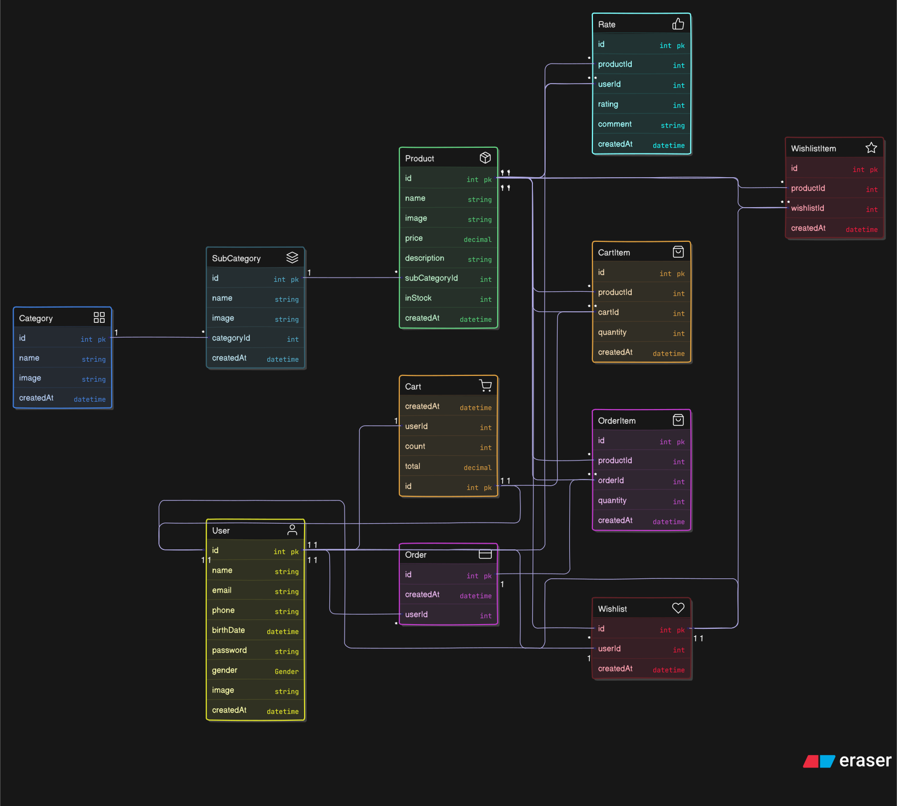

# Decor App Server

This is the backend server for the **Decor App**, an e-commerce platform for home decor products.  
It is built with **Node.js**, **Express**, **Prisma ORM**, and uses a **SQLite** database by default.

---

## Features

- **User Management**: Register, login, and manage user profiles.
- **Product Catalog**: Categories, subcategories, and products with images, prices, and descriptions.
- **Cart System**: Add, update, and remove products from the cart.
- **Order System**: Place orders from cart, manage order items, and track order history.
- **Wishlist**: Save favorite products for later.
- **Ratings**: Users can rate and comment on products.
- **Timestamps**: All models include a `createdAt` field for tracking creation time.
- **Cascade Deletes**: Deleting a user will cascade and remove all related data (cart, orders, wishlist, etc.).

---

## Tech Stack

- **Node.js** & **Express**: REST API server
- **Prisma ORM**: Database modeling and queries
- **SQLite**: Default database (easy to switch to PostgreSQL/MySQL)
- **Zod**: Schema validation
- **TypeScript**: Type safety

---

## Project Structure

```
src/
  v1/
    controllers/   // Express route controllers
    routes/        // Express route definitions
    services/      // Business logic and Prisma queries
    schemas/       // Zod validation schemas
    config/        // Database config
prisma/
  schema.prisma    // Prisma data model
```

---

## Database Models

- **User**: Basic user info, authentication, and relations to cart, wishlist, orders, and ratings.
- **Category/SubCategory**: Product organization.
- **Product**: Main product data, linked to subcategories, cart items, order items, wishlists, and ratings.
- **Cart/CartItem**: Shopping cart and its items.
- **Order/OrderItem**: Orders and their items.
- **Wishlist/WishlistItem**: User wishlists and their items.
- **Rate**: Product ratings and comments by users.

All models include a `createdAt` field:

```prisma
createdAt DateTime @default(now())
```

---

## Getting Started

1. **Install dependencies**

   ```sh
   npm install
   ```

2. **Set up the database**

   - Edit `.env` if you want to use a different database.
   - Run Prisma migrations:
     ```sh
     npx prisma migrate dev --name init
     ```

3. **Generate Prisma client**

   ```sh
   npx prisma generate
   ```

4. **Start the server**
   ```sh
   npm run dev
   ```

---

## API Overview

- **/cart**: Get, create, update, and delete cart and cart items.
- **/order**: Get, create, update, and delete orders and order items.
- **/wishlist**: Manage wishlists and wishlist items.
- **/products**: List and view products.
- **/categories**: List categories and subcategories.
- **/rate**: Rate and comment on products.

---

## Notes

- **Transactions**: Order creation and stock updates are wrapped in transactions for data consistency.
- **SQLite**: Good for development and testing. For production, consider PostgreSQL or MySQL for better concurrency and row-level locking.
- **Cascade Deletes**: Deleting a user will also delete their cart, orders, wishlist, and ratings.

---

---

## License

MIT
